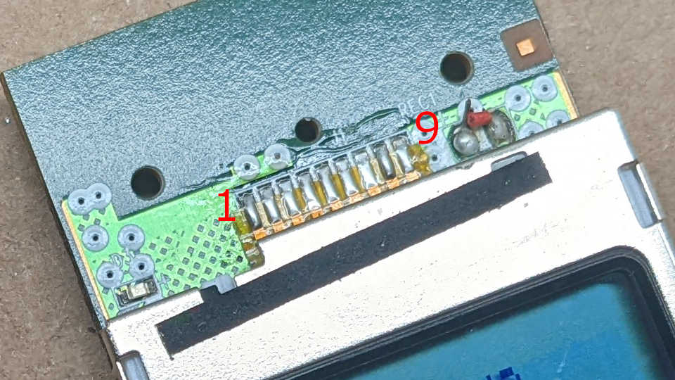
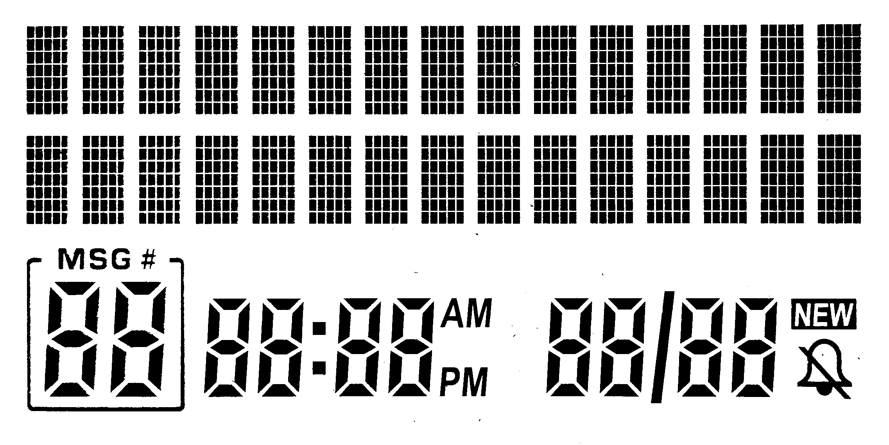
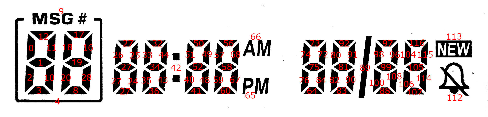
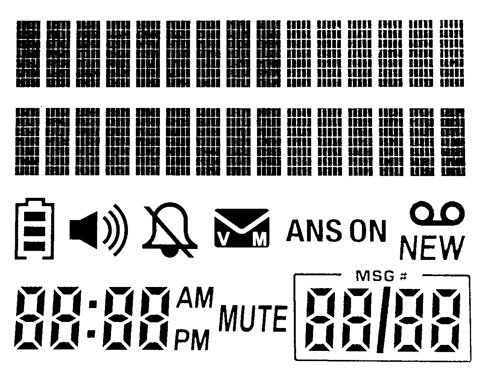
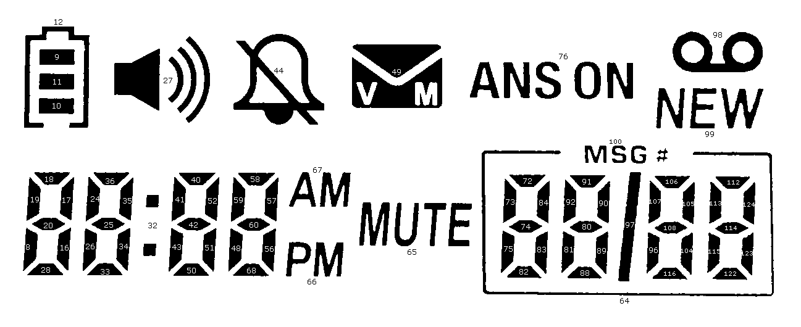
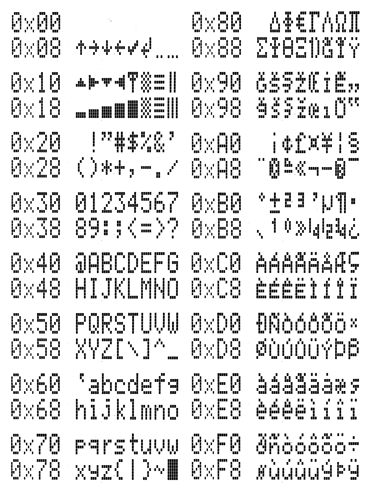

# Control LCD From AT&T CL84209

This repository contains code and related information for controlling LCD units
salvaged from an AT&T CL84209 cordless landline phone system. There are two
distinct display units for the base station and cordless handset, but they are
both 3.3V I2C peripherals on address 0x3E and respond to the same commands.

__lcd_cl84209.ino__ : Arduino sketch for ESP8266 demonstrating commands.

__logic_analyzer_captures__ : Directory of Saleae Logic analyzer capture files
showing traffic between handset circuit board and handset LCD.

__character_set_photos__ : Directory of intermediate images used to generate
the character set at the bottom of this page.

---
## Electrical connection
Numbered from left-to-right when looking at the front of the screen.

1. Enable. Use 1k resistor to Vcc to always enable.
2. SCL for I2C clock.
3. SDA for I2C data.
4. Ground.
5. Vcc for +3.3V power supply.
6. Output of built-in boost converter, needs a 0.82uF capacitor to pin 5 Vcc.
7. LCD segment voltage (high), needs a 0.82uF capacitor to pin 8.
8. LCD segment voltage (low)
9. Not connected. (Measured voltage close to pin 6.)

---
## Base station LCD

All segments active

Custom segments map

---
## Handset LCD

All segments active

Custom segments map

---
## Character Set

